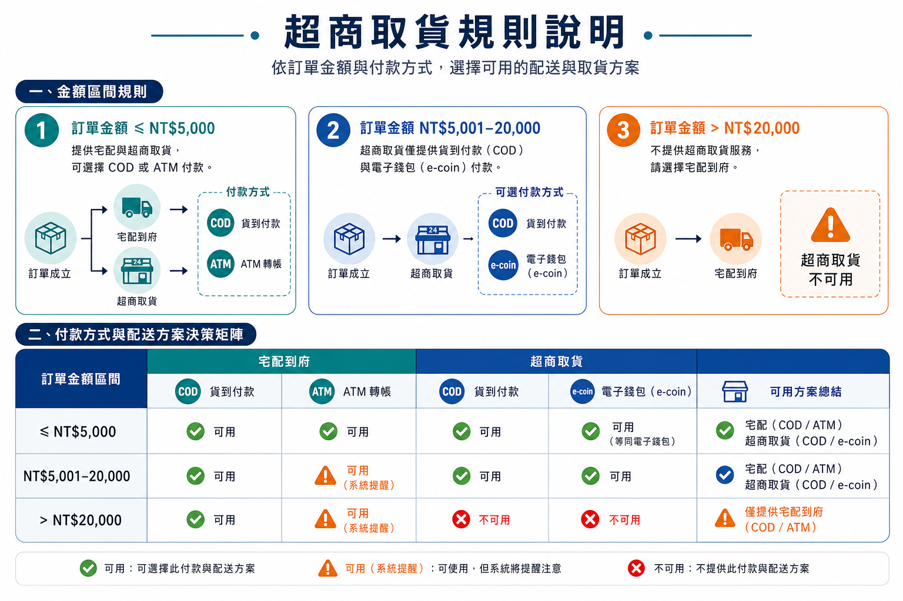

# 建圖流程

本流程用於將 `data/sources/csp/` 的原始文件，整理成可閱讀、可放入 Note 的流程圖或資訊圖表。

## 流程總覽

```text
原始文件
   ↓
來源狀態檢查
   ↓
整理成 Markdown
   ↓
確認圖表目的與範圍
   ↓
撰寫圖稿規格
   ↓
使用 imagegen 產生圖片
   ↓
人工檢查文字、規則與版面
   ↓
存放至 img/
   ↓
更新索引並推送 Git
```

## 1. 檢查來源文件

將新 PDF 放入 `data/sources/csp/` 後執行：

```bash
python3 scripts/check-source-status.py
```

處理結果：

- `已整理`：不需重做
- `內容已變更，需重新整理`：先更新對應 Markdown
- `尚未整理`：先建立來源對應與整理文件

## 2. 整理成可建圖內容

先將原始文件整理成結構化 Markdown，至少確認：

- 流程起點與終點
- 判斷條件
- 每個分支的結果
- 例外與錯誤處理
- 需要保留的代碼、欄位或金額
- 不應放入圖片的密碼、Token 等敏感資訊

圖片只表達已確認的規則；若原始文件有矛盾，先在 Markdown 中標記待確認，不直接猜測。

## 3. 定義圖稿規格

每張圖先決定：

| 項目 | 說明 |
|---|---|
| 圖名 | 例如：超商取貨規則說明 |
| 用途 | Note、簡報、教育訓練或排錯 |
| 讀者 | 開發、測試、客服或一般使用者 |
| 圖型 | 流程圖、決策樹、決策矩陣或資訊圖表 |
| 範圍 | 一張圖只處理一個主題 |
| 文字 | 指定繁體中文與必要的代碼原文 |
| 輸出 | PNG，放在 `img/` |

## 4. 使用 imagegen 建圖

建議提示詞包含：

```text
Use case: productivity-visual
Asset type: business process infographic
Primary request: <要表達的規則或流程>
Audience: <讀者>
Layout: <橫式或直式；流程圖、決策樹或矩陣>
Text: Traditional Chinese; preserve exact codes and numbers
Style: clean enterprise documentation, clear arrows and cards
Constraints: no secrets, no logos, no watermark, no tiny text
```

圖片生成後需檢查：

- 中文、數字、代碼是否正確
- 箭頭方向與分支是否符合 Markdown
- 圖片是否能在 Note 中閱讀
- 是否誤放密碼、Token 或內部敏感資訊

若文字不清楚，優先改成較少文字的圖，再用 Markdown 補充細節。

## 5. 存放與命名

圖片放在：

```text
img/<主題英文或拼音>.png
```

目前範例：

```text
img/business-rules-pickup.png
```

同一主題重新生成時，使用版本名稱，例如 `business-rules-pickup-v2.png`，不要直接覆蓋既有版本。

## 6. 完成檢查

```bash
python3 scripts/check-source-status.py
git status --short
git diff --check
```

完成後更新相關 Markdown 的圖片連結，例如：

```markdown

```

最後再提交並推送 Git，讓原始文件、整理內容與圖稿保持同一版本。
